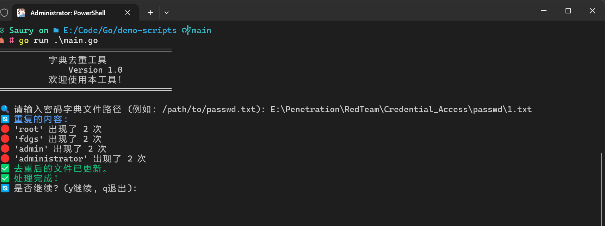

# 密码字典去重工具

## 简介
这是一个用 Go 语言编写的密码字典去重工具，旨在帮助用户快速识别和移除文本文件中重复的密码条目。用户可以输入密码字典文件的路径，程序将输出重复的条目并更新文件为去重后的版本。

## 功能
- 读取用户指定的密码字典文件
- 统计并显示重复的密码条目及其出现次数
- 将去重后的内容写回源文件
- 用户友好的交互界面

## 安装和运行

### 先决条件
- 安装 Go 语言环境 [Go 官网](https://golang.org/dl/)
- 具备基本的命令行操作能力

### 安装步骤
1. 下载或克隆本项目到本地：
   ```bash
   https://github.com/z50n6/password-deduplicator.git
   cd password-deduplicator
   ```
   

